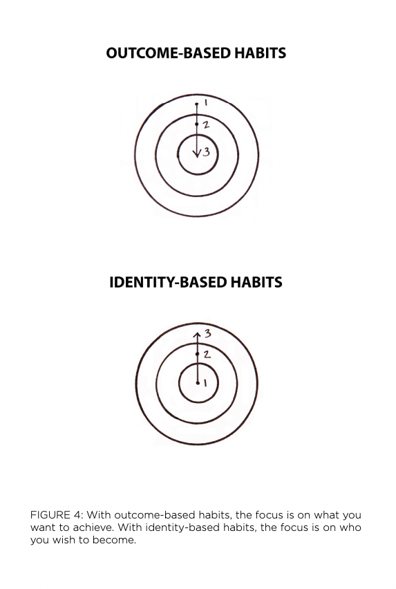
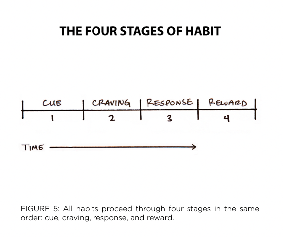
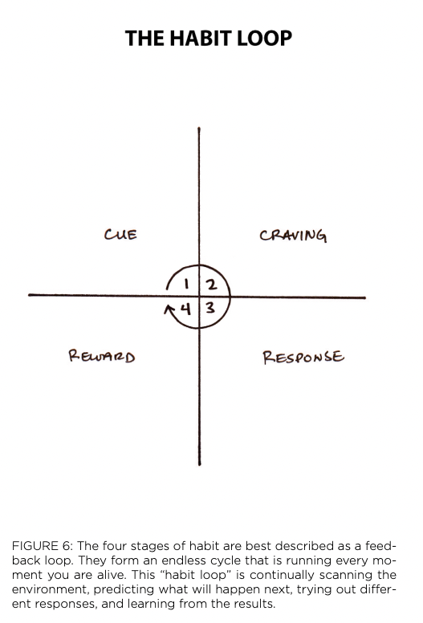

# Atomic Habits

# Shaping your Identity though Habits

 There are three levels of change that can come from habits:

- Outcome
- Process
- Identity

If we want to cement a habit, we should aim to reach the Identity level of habit formation. We often focus on goals we would like to achieve, but these goals can be fleeing and require a continuous source of motivation to push towards. 

Outcome based goal: I want to write a book

Identity based goal: I want to become a writer

If we can get to the identity level, we will begin to form a feedback loop between ourselves and our habits. We form a sense of pride about our perceived personalities, and it makes it easier to do actions associated with that attribute.

First we need to work towards the Identity change, and we can do that by simply doing actions that type of person would do. Each action you perform is a vote for the type of person you want to become. As we progress, we need to constantly edit our own beliefs about ourselves. 

It may be easy to say today, ‘I am smart’, because I have read many books. 

It may be hard to say, ‘I care about my health’, because I do not go to the gym.

It is very important to phase it in this way, not as an *Outcome* based changed but as an **Identity** change!

- I have gone to the gym consistently, so I am someone who cares about health.
- Not - I am trying to become someone who goes to the gym.

This works in reverse too, habits of youtube + reddit reinforce the belief that I am a lazy person, I do not have interesting hobbies. By doing other actions - writing, reading, gym, projects - you are placing votes for your identity, that you can later look back and convince yourself you are the type of person you are trying to become. As you become convinced that is who you are, these habits become possible to maintain for long periods of time. 

Working off of motivation will only get your brief bursts. But making changes to your identity will continue to feed off each other.

> I take pride in caring for my fingernails, therefore I am not apt to bite them.
> 

## Stages of Habits - Making space for Creativity

Habits are a list of steps we can repeat when needed. They are default behaviours that get triggered by some cues. 

As we take basic actions over and over again, they become habits, and free our brain from having to make conscious decisions to do those actions. 

1. The room is dark
2. I want to see
3. I click the light switch on 
4. I can now see

A very basic ‘habit’ we have performed thousands of times and now do without thinking. We should uset his power for larger behaviours to automate getting the basics of life done.

Right now I do not go to the gym often, or on any regular schedule. I have to consciously think about taking that action. If I can turn this into a habit, I have essentially automated it and can free up brainpower for other things.

 

These habits do not make our lives repetitive, but instead free us for creativity. By having a habit to sit and write, or work on a project, the brain power that would normally be spent trying to convince yourself to take action can now be spent on creativity.

---

# First Law: Make it Obvious

## Pointing and Calling

Many of our current habits are engrained in us from such a long period of repetition. Following from last chapter, do not think about habits as large changes you want to make, process you want to follow or tasks you want to do. Think of the little actions you do from the moment you wake up that fill your day.

- Do you wake up and snooze your alarm, or get out of bed?
- Do you brush your teeth first thing in the morning?
- Do you bite your nails when you are stressed?
- Do you reach for your phone when you are feeling aimless?

We have many little cues built into us that we do not recognize when a one is taking over and leading us to action. This cue could be feeling hungry, stressed, or tired, and it triggers an unconscious decision in us. This feeling has already occurred in the past, and a decision has been made many times: ‘I want something to entertain myself with, I’ll take a look at my phone and see if I have any messages’. 

Our brains are actually quite efficient here. A decision was made long ago that this is how we will deal with this issue, why should we bother the conscious mind with this problem? 

The first step in removing a bad habit is identifying that it even takes place, before it happens. A technique to tackle this is called Pointing and Calling.

<aside>
💡 Pointing and Calling is used by crew at a train station. Before the doors of a train close, the employees need to physically point to each of the doors that they are checking, and audibly call out their status.

</aside>

By making ourselves physically go through the actions of a repetitive task we will be performing over and over, we help lift the process from our subconscious and into our conscious. The railway employees are likely to not realize when an issue arrises if they are in the habit of only glancing at each door before departure.

 In the same way, we are not likely to notice the problems in our own actions if they are taken without conscious thought. We can use Pointing and Calling to say our thought process out loud and bring it to the forefront of our mind.

## Time and Place & Environment

What about bringing in new positive habits into our lives? Pointing and Calling makes existing habits obvious, so we need new ways to introduce new habits. Two great method are setting a time and place, and priming your environment for positive habits.

By setting a time and place, 9am at the dining room table, it becomes unambiguous when an action should take place. Wanting to build a new habit of writing or drawing is a nice thought, but if it is not **obvious** when it should occur, it will be very difficult to bear fruit. So much of our life is driven by our existing habits, our subconscious directing our actions based on our life thus far, that the new habit won’t magically find a time to happen regardless of how strong our motivation to do them. 

We simply do not have existing empty spaces in our life, waiting for this new ‘productive’ habit to settle in. We have decades of experience of filling those hours, and that momentum is not broken easily.

---

# Second Law: Make it Attractive (Craving)

## Irresistible Habits

We can pair a habit with something else we already crave. 

## Peer and societal pressure

Activities and behaviours exhibited by those around us are instinctively seen as attractive. It is basic human nature to want to be accepted by our peers, and gain status among them.  Because of this, we are naturally attracted to actions that we perceive as normal in three groups:

 

- Those close to us
- The Masses
- The Powerful

For example, Joining a team or club, intensifies the **Identity Change** as beyond something I am, it is something we *all* are. Not only am *I* a runner, but I am connected to a group of runners and I value being part of that community. This makes running **Attractive**.

We tend to follow the masses, and not always in a positive way. A provided example is a chimp with a superior method of cracking nuts joins a new community and begins to copy their method, even though it is less effective than his own. In general we would rather be wrong together than correct but apart.

---

# Third Law: Make it Easy

## Walk slowly, but never backwards

A common question is how long does it take to build a habit, but it is misleading. We should instead be focused on how *many* does it take to build a habit. 

We tend to get caught up in Motion versus Action. Motion is the preparation for something, action is actually doing the thing. We can look up the best and most optimal work routines, or we can just start going to the gym. We can prepare and organize our novel, or we can just start writing. 

Motion is often driven by fear. If we fear failure, then Motion gives us the satisfaction of Action without the potential to fail doing it. 

<aside>
💡 Remember the group of photographers: Half are graded on the amount of photos taken, the other graded on their single best photo. The half who are required to take 100 photos regardless of their outcome had far superior ‘best’ images, while those who spent their time speculating on *how* to create the best image ended up with one mediocre image.

</aside>

---

## Law of Least Effort

Conventional wisdom tells us that motivation is key to habit change, if we *really* wanted the change we would be able to do it. But overall, we are motivated to do what is easy. We will always aim to conserve our energy, and this is not a failing on our part, it is a law of nature. Energy is previous, we should conserve it.  Given two similar choices, we will naturally gravitate to what takes the least amount of work.

When creating habits, we are not looking to achieve the habits themselves, we are looking for their end state. 

- Working out to be fit
- meditation to increase peace

These habits are actually a **friction** in the way of achieving some goal. The energy required is a roadblock in front of our end goal, and we get diverted from our path. By making our habits take as little energy as possible, we are paving the way towards achieving the goals by building up the repetitions of the habit.

Does this mean we cannot do difficult things? Of course not, some days we will have the motivation to expend large amounts of energy.. but some days we will not. We are paving the way with low-energy habits so that on those low-energy days we can continue to do them.

By doing the easy habits even on low energy days we build it into our identity.

### How do I decrease the energy required for these habits?

Practice environment design by filling things into the flow of your life, in addition to setting cues (from chapter 6). A cue might be at this time, or after this action, I will do X. Reducing the effort might be:

- Choose a gym on your path to work. Put out your clothes ahead of time.
- Reset the room: put pencils and paper out ahead of time ready to draw
    
    

<aside>
💡 Imagine water flowing through bent hose. To increase the output you can turn up the pressure, requiring more effort and increased tension in life. Or you can unbend the hose, reducing the friction while still seeing a greater output.

Lean production in Japanese electronics factories: companies spent years reducing the friction of workers on the factory floor. Less turning and movement for their employees, simplifying the workflow. Addition by subtraction.

</aside>

---

# Fourth Law: Make it Satisfying

*Immediate-Return Environment*: an environment in which actions instantly deliver clear and immediate outcomes. Our ancestors experienced this more as they were hunting for food and watching out for predators. In the current times, however, we do not experience immediate results often.

*Delayed-Return Environment*: the choices that we make today will not benefit us immediately and sometimes is takes us years before our actions deliver the intended payoff.

*Time Inconsistency*: the brain evaluates rewards inconsistently across time and the present is more valued than the future. We prefer quick payoff to long-term payoffs.

It can be difficult to stop eating junk food for example, because the rewards are immediate and the punishments are in the future. 

**The Cardinal Rule of Behavior Change: What is immediately rewarded is repeated. What is immediately punished is avoided.**

<aside>
💡 People from a small village, who had the knowledge that washing your hands was a sanitary practice and would help lessen their sickness, were still not in the habit of doing it.

Soap companies that foam well and smell nice, made a small habit like washing your 
hands immediately satisfying.

</aside>

---

# Keeping it Interesting

## Goldilocks Rule

The biggest risk to habits is boredom. Humans crave novelty, anything we repeat we are are at risk of losing our excitement with the task.

To keep a task interesting, it is ideal for it to be *just* within our current capability. When something is doable, but reaching it requires focus and a push of energy, we experience peak motivation and bursts of happiness.

<aside>
💡 If we play a tennis match against a toddler, we will quickly get bored. It’s too easy.
If we play a tennis match against Roger Federer, we will quickly get bored. Too hard.

When we play against someone of an equal skill, we may be able to win *if* we try try our best. Our vision narrows, distractions fade, and we enter the elusive ‘zone’ of focus.

</aside>

 In order to reach this flow state, you need to not only work on challenges at a certain difficulty, but also to **measure your immediate progress**. Sports have a great feedback loop, performing well against an opponent gives you immediate feedback on your expended effort.   

Other facets of life do not have this by default, and we need to find ways to visualize our progress to keep ourselves motivated and in a flow state. 

## Performance Retrospective

The upside of habits is that we can begin to do things automatically, we do not have to expend mental effort to make something happen. This can also be a downfall, long term.

When a habit becomes trivial, let’s say we have been taking the same actions for the last 6 months, we begin to do it without thinking. This is great! We have improved at the task and are one step closer to mastering it. Unfortunately, we have also **fallen out of the Goldilocks Zone.**

Since this task is now easy for us, we run a greater risk of losing motivation. *Skipping a day won’t be a big deal, it’s a trivial task and is pretty boring anyway, why would I continue?* 

Creating a review a few times a year to comb through your goals, realign with your desired identity, and adjust the difficulty according to your progress is key to maintaining progress and motivation in the long term.