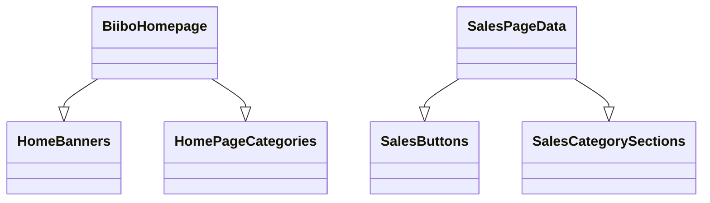
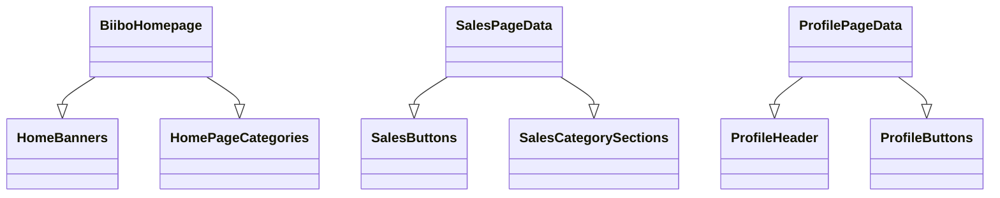
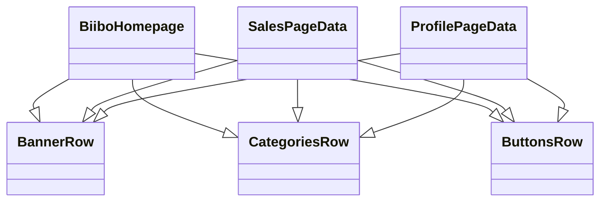

# HomepageRow vs DynamicRow

# HomePageRow vs DynamicRowItem

## What we have now

Here is an example of our current Doctype structure for Home Page and Sales Page.

- BiiboHomepage has children tables, such as HomeBanners and SalesButtons.
- SalesPageData has SalesButtons, SalesCategorySections



Here are some of their field lists.


## Where we are heading

During our meeting February 21, 2024 we started to discuss how our Profile Page would look; with a single large banner at the top like we have on the Sales Page, versus an array of banners like we have on our home page. We were discussing difficulty of doing one over the other.. which **doesn’t make any sense, we have already done both**.

This is what I’m afraid of happening. We build a series of components that is unique to each page, and have to do more work to make simple changes.



## Suggestions

What I was suggesting was *reframing our old items in our heads* by renaming them:

- HomeBanners → BannerRow
- HomePageCategories → CategoriesRow



Our top level ‘Page’ doctypes need to remain unique, because each page has a different set of items it wants to display.

The Rows that make up each page should be generic, to be used on any page.

## API

What does this mean for the specific API we were talking about.

Biibo Homepage has ‘Home Banners’ Section.

→ Rename the child table. This is the Banners sections. Home is redundant.


Screenshot 2024-02-22 at 11.32.23 AM.png

### Profile Page

💡 @Aji If you want banners in the new Profile Page, simply add a Banners section. The front end has seen a ‘BannerRow’ before and should handle it.

The profile page should follow the Home page format. A table of Sections , where we can add any RowItem we would like.

Mobile Homepage Section → DynamicRowItem

Screenshot 2024-02-22 at 11.41.23 AM.png


### Existing Sales Page

Notice the existing sales page does not quite follow this pattern. It is not a table of Sections, but instead just uses a bunch of child tables to add items in a static order.

This wouldn’t be touched now as its out of scope. But we would have this pattern in place for the next time we want to touch Sales Page.

- See API Code
    
    ```python
    def get_mobile_sales_data(city="Toronto"):
        result = []
        sections = frappe.get_doc("Mobile Sales Data", {"city": city}).as_dict().sections
        for section in sections:
            section_result = {}
            if section.product:
                section_result["product"] = frappe.get_all("Mobile Homepage Product Section", fields=["view_all_input", "product_title", "product_description", "product_input"] \            , filters={"name": section.product})[0]
            else:
                section_result["product"] = None        if section.category:
                section_result["category"] = frappe.get_all("Mobile Homepage Category Section", fields=["category_title", "category_input"] \            , filters={"name": section.category})[0]
            else:
                section_result["category"] = None        if section.banner:
                section_result["banner"] = frappe.get_all("Mobile Homepage Banner Section", fields=["banner_image", "banner_deeplink", "banner_input", "banner_aspect_ratio", "background_color"] \            , filters={"name": section.banner})[0]
            else:
                section_result["banner"] = None        if section.countdown:
                section_result["countdown"] = frappe.get_all("Mobile Homepage Countdown Section", fields=["target_date", "target_time", "background_color"] \            , filters={"name": section.countdown})[0]
            else:
                section_result["countdown"] = None        if section.deep_links:
                section_result["deep_links"] = frappe.get_doc("Mobile Deep Link Section",  section.deep_links)
            else:
                section_result["deep_links"] = None        section_result["is_pro"] = section.is_pro
            section_result["non_pro"] = section.non_pro
            result.append(section_result)
        return result
    ```
    

---

# Migration Steps 02/26

| From | To | Notes |
| --- | --- | --- |
| Mobile Homepage Section | [Dynamic Row Item](http://44.214.135.95/app/doctype/Dynamic%20Row%20Item) | A dynamic row holds a single row, with some metadata (is pro) |
| Mobile Homepage Product Section |  |  |
| Product Row |  |  |
| Mobile Homepage Category Section |  |  |
| Category Row |  |  |
| Mobile Homepage Banner Section | Single Banner Row |  |
| Mobile Homepage Countdown Section | Countdown Row |  |
| Mobile Deep Link Section | Button List Row |  |
|  | Profile Page Data |  |
| Homepage Data | Home Page Data | These could also hold web page data, not just mobile |
| **Mobile Sales Data** | **Sales Page** | name: **Sales Page Data was already taken** |
|  |  |  |