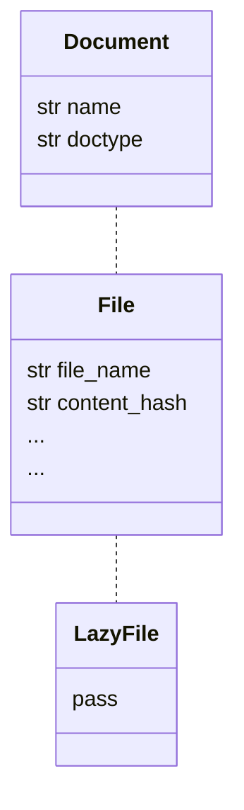

# Lazy Loading Frappe Documents

Lazy loading is the act of loading something in to memory only when it is needed.

💡 Here is a proposed solution for lazy loading Frappe Documents: LazyDocument
[https://bitbucket.org/biiibo-dev/biiibo_app/pull-requests/276](https://bitbucket.org/biiibo-dev/biiibo_app/pull-requests/276)

# Why Lazy Load

We still have a big issue when it comes to Object Oriented Programming in our backend, and it originates from how frappe fetches data.

frappe.get_doc()

→ returns to us a single *object* of the specified doctype ✅

frappe.get_list() / frappe.get_all()

→ returns to us an *array of dictionaries,* containing *some* of the fields of the doctype 💩

Honestly in my opinion, this makes .get_list and .get_all **useless**.

Why? If we only get select properties from an object, we lose

1. The ability to abstract.
The function that fetches data need to know exactly how that data is going to be used. It needs to know that I am fetching a list of quotations *because* I want to look at the quotation’s order list. This code becomes tightly coupled with its future usage
2. The ability to use the objects existing relationships.
Objects give us context as to what actions we can perform, and what attributes they have. It should be very easy for me to ask, ‘what can a SalesOrder do?’ ‘What is the highest net weight of all of my SalesOrder’s Items?’. When working with a string, we lose these relationships and have to instead resort to creating more helper functions.

```python
@staticmethoddef get_quotations_containing_item(item_code: str) -> [str]:
  '''Get all quotation items that include the specified item_code'''  
  all_quotation_items_includes_item = frappe.get_all("Quotation Item",
      filters={"item_code": item_code},
      fields=["parent"])
  
  quotation_list = [quotation_item['parent'] for quotation_item in all_quotation_items_includes_item]
  return quotation_list
```

What is the first thing that a caller of get_quotations_containing_item would probably do?

```python
// Ok, I have the quotation.name. Now I want an attribute from each quotation
// Guess I'll just fetch from the db.for quotation in quotations:  pl = frappe.get_value("Quotation", quotation.name, "price_list")
    // Hmm lets see, I have a price list's ... *name.* Shit*.*    // I know theres a function on PriceList 'for_pro_user() -> bool', but ...    // I'll just grab the value since I know what its called.    frappe.get_value("PriceList", pl, "is_pro") // 💀
```

If we do not have objects to work with, we are not following object oriented programming. We will end up re-writing the same scripts with slightly different configurations forever.

---

# Usage

When creating a new lazy document type, include this block at the end of the original file.

This code extends the File doctype to be able to be lazy loaded

```python
# === Lazy Object ===from biiibo_app.utils.lazy_document import LazyDocument
class LazyFile(File, LazyDocument):
    doctype: str = "File"    def __init__(self, name: str):
        super().__init__(self.doctype, name)
```

This is how we define a function to return a lazy loadable File.

```python
# === Static Methods ===
@staticmethod
def files_matching_name(filename: str) -> [File]:
    return LazyFile.documents_by_filter({"file_name": filename})
```

<aside>
💡 Notice we still return a list of [File] to the caller. 
The caller does not care that this is a lazy loaded object.

</aside>

```python
existing_files = File.files_matching_name(filename)
if len(existing_file) > 0 and existing_file[0].is_image():
    existing_file[0].delete()
```

Notice how we don’t have to use any frappe functions here? We can use both custom functions we have defined, like .is_image(), and the Document’s own .delete() instead of importing frappe in every single file.

~~frappe.get_list()~~

~~frappe.get_value()~~

~~frappe.db.delete()~~

---

# Example (see File.py in [PR](https://www.notion.so/fb4b4e0a4e6a41a99dbe88c004f041e7?pvs=21))

### Previous

```python
def unzip()
	...

	// We are unable to abstract this getter for all files with file_name
	existing_files = frappe.get_list("File", filters={"file_name": filename}, fields=['name', 'file_name', 'content_hash'])
	
	...

	// We have to remember each time what properties we want to compare, and match dictionary values
  if (len(existing_files) == 1 and
      existing_files[0]['file_name'] == file_doc.file_name and
      existing_files[0]['content_hash'] == content_hash):
      continue

	..

	// We have to use lower level db functions, with "strings" on every single line we write
	frappe.delete_doc("File", existing_file["name"])
```

### Future

```python

// We are able to abstract out functions base on their use case
@staticmethod
def files_matching_name(filename: str) -> [File]:
    return LazyFile.documents_by_filter({"file_name": filename})

// We are able to use operator overloads to do common tasks between objects 
def __eq__(self, other: File):        
    if isinstance(other, File):
        return self.file_name == other.file_name and self.content_hash == other.content_hash
    
    return False

def unzip():

	...

	// We can treat both 'existing_files[0]' and 'file_doc' as objects
	if (len(existing_files) == 1 and existing_files[0] == file_doc):
	    continue
	   
	// We can use functions on Document class, to avoid writing "strings"
	for existing_file in existing_files:
	    existing_file.delete()
```

---

# How does it work?

A Document like ‘File’ is great to work with once fully loaded into memory with get_doc().

We can use properties of the object with the assumption they have been populated.

```python
file.file_name.suffix
```

This shouldn’t crash because our File Doctype has a property called file_name

In contrast, a LazyDocument is a sub class of a Doctype with none of the attributes populated.



When using a regular document, a property access might look like this

```python
file = frappe.get_doc("File", "file1")
other_file = frappe.get_doc("File", "file2")
file.content_hash == other_file.content_hash
```

```mermaid
sequenceDiagram
  function()-->>File: get content_hash
    File-->>File: check properties
    File-->>function(): return content_hash
```

When using a lazy document, we insert some extra logic when checking properties

```python
file = LazyFile("file1")
other_file = frappe.get_doc("File", "file2")
file.content_hash == other_file.content_hash
```

```mermaid
sequenceDiagram
  function()-->>LazyFile: get content_hash
    LazyFile-->>LazyFile: check properties
    alt property not found
        LazyFile-->>Database: fetch property
        Database-->>LazyFile: return db value
        LazyFile-->>LazyFile: save in memory
    end
    LazyFile-->>function(): return content_hash
```