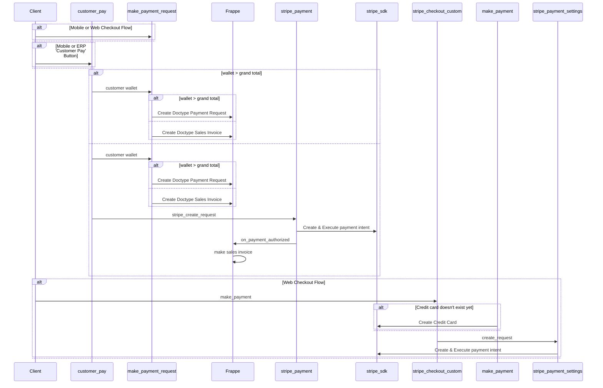
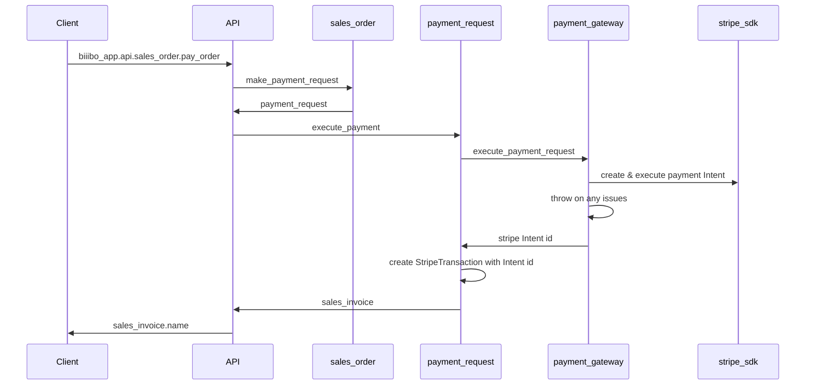
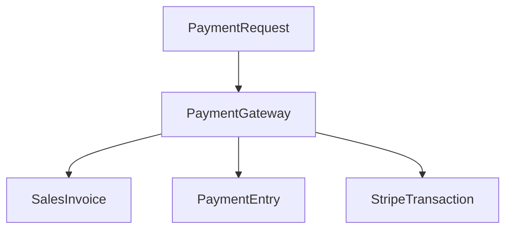
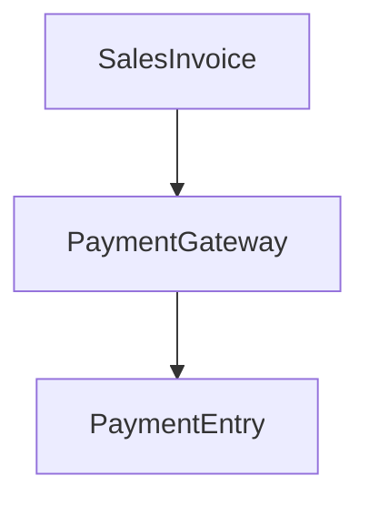

# Payments Refactor

## Goals

1. Phase 1: Have a clean, understandable payment code base that re-uses a single series of functions rather than re-write almost the same thing over and over.

- additional information saved back to our payment requests detailing stripe error codes
- I would like to change the actual payment flow, and this may require some changes to an automation we currently have where material purchases on our end are done immediately on sales orders

# Phase 1: Restructuring payment Code

Payments in our application are done through multiple avenues, attempting to do the exact same things.

For the first phase we want to rewrite the payment flow so it is more understandable and uses the same set of code for performing payment through ERP, web and mobile.

This is roughly how the payment was created before the refactor, and how it will continue to work after the refactor.

1. Create a payment request
2. Execute the payment through a payment gateway (Stripe currently)
3. Record the sale through a Sales Invoice, Payment Entry, and StripeTransaction.

## Before Refactor

- Split View System Only
    
    ### Web Checkout (System)
    
    ```mermaid
    sequenceDiagram
    
      	Web->>ERP: customer_wallet.api.make_payment_request
    		Web->>ERP: stripe_payment.templates.pages.stripe_checkout_custom.make_payment
    ```
    
    ### ERP ‘Customer Pay’ button in Sales Order
    
    ```mermaid
    sequenceDiagram
    
      	Sales Order->>ERP: bellamar_website.utils.sales_order.customer_pay
    		
    ```
    
    ### Mobile Checkout
    
    ```mermaid
    sequenceDiagram
    	Mobile->>ERP: customer_wallet.api.make_payment_request (OrderId)
    	ERP->>Mobile: Nothing
    	Mobile->>ERP: bellamar_website.utils.sales_order.customer_pay
    	
    
    ```
    

## All Previous Flows



## Refactor Goal



# Phase 2:  Follow-ups

## Rename

There are some name changes I would like to make, if everyone is agreeable. Stripe is our current Payment Gateway, but some of the objects we use to track a payment are named in reference to stripe. 

StripeVault → PaymentMethod, CreditCard (Open to suggestions)

StripeTransaction → PaymentGatewayTransaction

Neither of these are stripe specific and cause confusion at which module they should live in. They should live in biiibo_app, and we would need to create them even if we switched to another payment gateway.

## Include payed credit card Pan in Sales Invoice

There is a field already called pan (apparently sometimes it disappears), we would like under the advance’s table in the payments section

When the transaction goes through, the card used should be tagged on the Sales Invoice on the Pan field.

## Recurring Payments

\/home/ec2-user/frappe-bench/apps/bellamar_website/bellamar_website/utils/api.py

make_subscription_payment

The recurring payments workflow should also use our new workflow instead

# Phase 3: Changing Payment State Transitions

Everything in this phase is still being determined.  @Moses Kang Was going to have some relevant meeting just before the break

## Current States

1. Create a payment request
2. Execute the payment through a payment gateway (Stripe currently)
3. Record the sale through a Sales Invoice, Payment Entry, and StripeTransaction.



## Future States

We will be working with @Moses Kang on this, the future requirements are not settled. However, it would make sense to use the Sales Invoice as a ‘request to be paid’, and to mark payment entries against our stripe transactions. See ERP Flow

[https://docs.erpnext.com/files/overview-flow.png](https://docs.erpnext.com/files/overview-flow.png)

ERPNext does have the concept of a PaymentRequest, but it is in terms of sending the customer and email requesting an invoice to be paid. See 

[https://docs.erpnext.com/docs/user/manual/en/payment-request](https://docs.erpnext.com/docs/user/manual/en/payment-request)

> Before creating and using Payment Request, it is advisable to create the following first:
> 
> 
> 1. [Sales Invoice](https://docs.erpnext.com/docs/v13/user/manual/en/accounts/sales-invoice)
> 
> 3.[Sales Order](https://docs.erpnext.com/docs/v13/user/manual/en/selling/sales-order)
> 

It would be easier to further break into further logical components to do something like this



## Purchase Order Trigger

Unfortunately our current purchase orders are triggered when a Sales Invoice is created, and we cannot begin purchasing materials until customers have paid for them. We will need to see if we can change that trigger, before we can commit to reworking the above flow.

## Security Issues

There are some issues that have arisen where payment did not create a Payment Entry. This HIT ticket has an example

[https://biiibo.atlassian.net/jira/servicedesk/projects/HIT/queues/custom/1/HIT-589](https://biiibo.atlassian.net/jira/servicedesk/projects/HIT/queues/custom/1/HIT-589)

This was currently fixed via a quick fix of hiding the ‘customer pay’ button on ERP if the conditions were not correct. For example: a sales invoice already exists, or a payment entry already existing, avoiding cases where a partially complete payment would try to go through again.

While that exact case was solved for, the possibility of executing a payment through our gateway without also creating a payment entry still exists and needs to be considered.

## Error codes

We need more information on a stripe transaction about the failure reason. This is a requirement from @Aji 
[https://stripe.com/docs/declines/codes](https://stripe.com/docs/declines/codes)

### Paying for a Sales Invoice

We should be able to pay for a sales invoice in addition to paying for a sales order. After changing the payment flow, this is simply adding the button to the Sales Invoice page